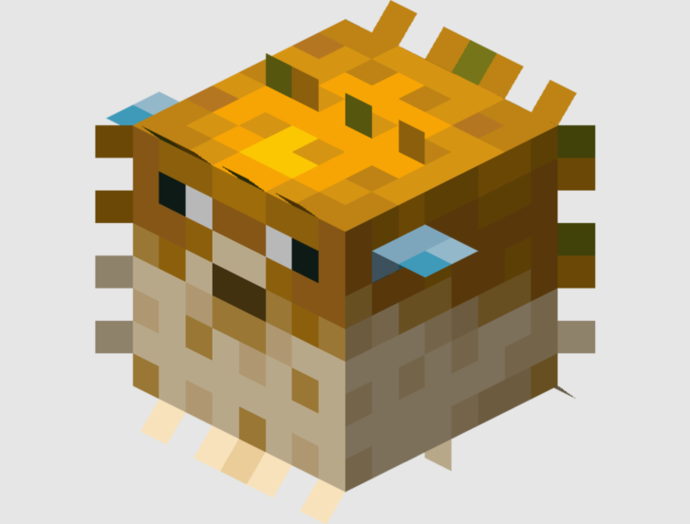

<html>
    <head>
        <title>Профиль</title>
        body {
            margin: 0;
            background-color: #ECF3F5;
        }
        .panels {
            position: absolute; 
            align-items: center;
            justify-content: center;
        }
        .pedia {
            position: relative;
            width: 300px;
            height: 300px;
            background-color: #fff;
            box-shadow: 0px 2px 2px rgba(0,0,0,0.1);
            display: flex;
            justify-content: center;
            border-radius: 32px;
            margin: 50px;
            top: 70px;
            margin-left: 175px;
        }
        .img3 {
        }
    </head>
    <body>
        

            

                
            

            

            

            

            

        

    </body>
</html>
